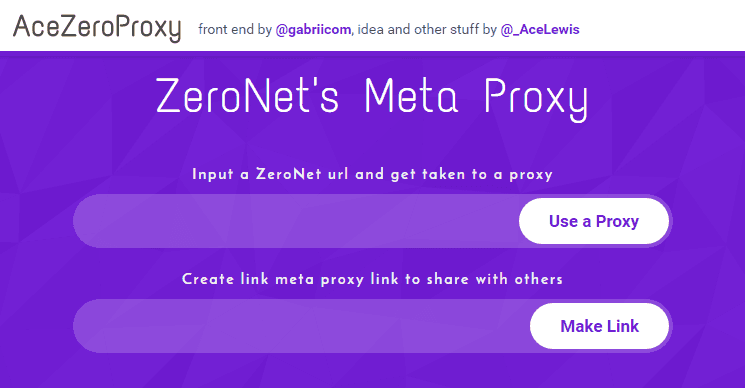

# AceZeroProxy - ZeroNet's Meta Proxy

ZeroNet is a way to host websites in a decentralised manner, to view these sites you need to have ZeroNet installed on your PC or use a ZeroNet proxy. The big problem is many ZeroNet proxies may only run for a week or a month this is a big problem that AceZeroProxy addresses.

This ZeroNet meta proxy is simple to use, try it out [https://zero.acelewis.com](https://zero.acelewis.com) and read below how it works.

# The Problem

If you are using ZeroNet and want to share a link with a someone then they must have ZeroNet installed unless you use a ZeroNet Proxy. The big problem with ZeroNet proxies is sometimes they go down... actually they quite often go down. This is a big problem if you want to post links to a ZeroNet proxy on a blog post or on social media because you would have to go through and update all the link when the ZeroNet proxy goes down.

The second problem is that it may be difficult to remember the link to a working proxy, with this meta proxy you only need to remember one somewhat simple address: [https://zero.acelewis.com](https://zero.acelewis.com)

# How this works
This is done 100% in client side Javascript, this means that I will not know the sites that you have visited whilst using the ZeroNet Meta Proxy (the proxies will) but more importantly it can be hosted for free on Github Pages.

All this does is takes a ZeroNet link and redirects that link to a random ZeroNet proxy (currently I am only using ZeroNet Proxies that run on port 80/HTTP or 443/HTTPS as they bypass simple port blocking).

##### How to convert a ZeroNet link into a ZeroNet Proxy link

The easiest way is to just use the website however if you want to do it programmatically you can do the following:

Take the ZeroNet URL for example;

[http://127.0.0.1:43110/1LennyjL5VUTvwiLtBUjMrZ85gCbVe1dj1/](http://127.0.0.1:43110/1LennyjL5VUTvwiLtBUjMrZ85gCbVe1dj1/)

and then replace the [http://127.0.0.1:43110/](http://127.0.0.1:43110/) with [https://zero.acelewis.com#](https://zero.acelewis.com#). Which gives;

[https://zero.acelewis.com#1LennyjL5VUTvwiLtBUjMrZ85gCbVe1dj1/](https://zero.acelewis.com#1LennyjL5VUTvwiLtBUjMrZ85gCbVe1dj1/)

# Warning

I do not recommend using a ZeroNet proxy to sign in to ZeroNet as it is technically possible for the proxy to steal your private key. Only use these ZeroNet proxies to browse ZeroNet sites. I will not know the sites you visit but the proxies obviously will.
